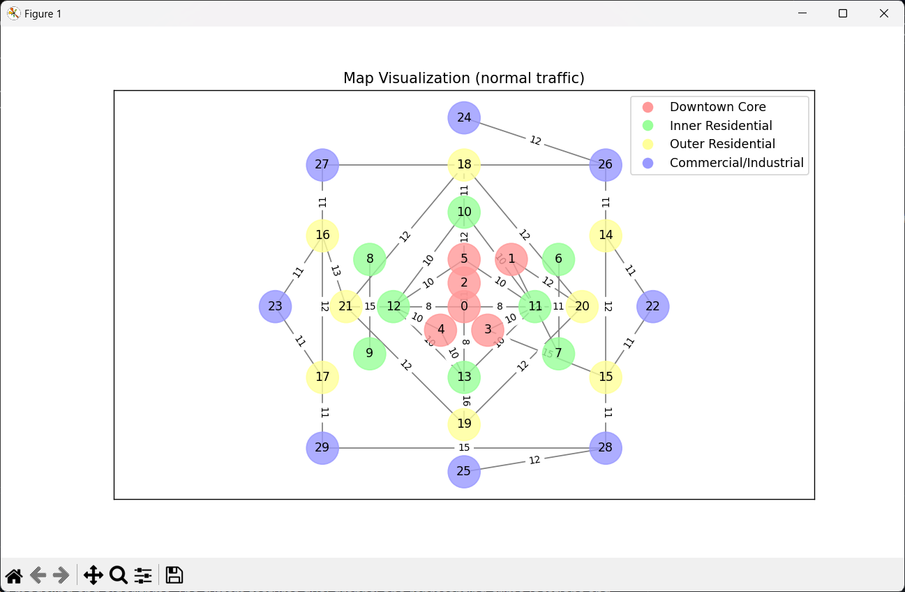
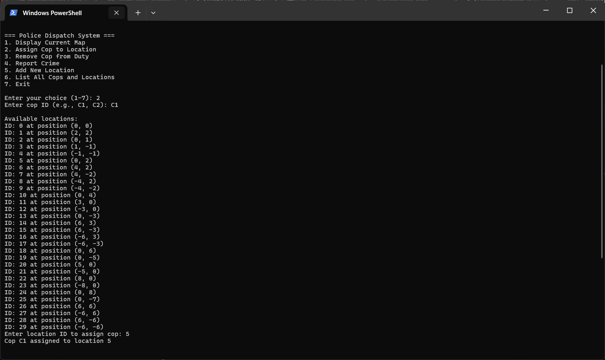
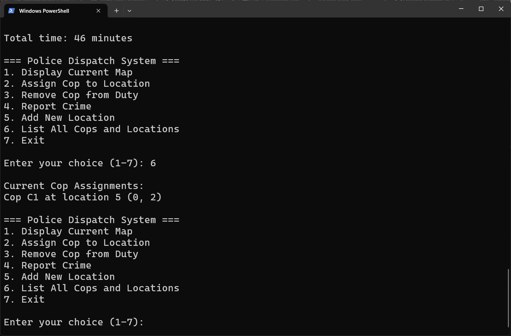
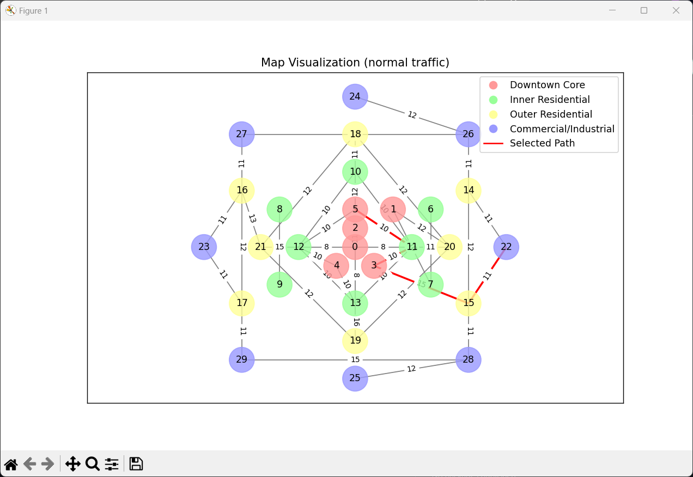
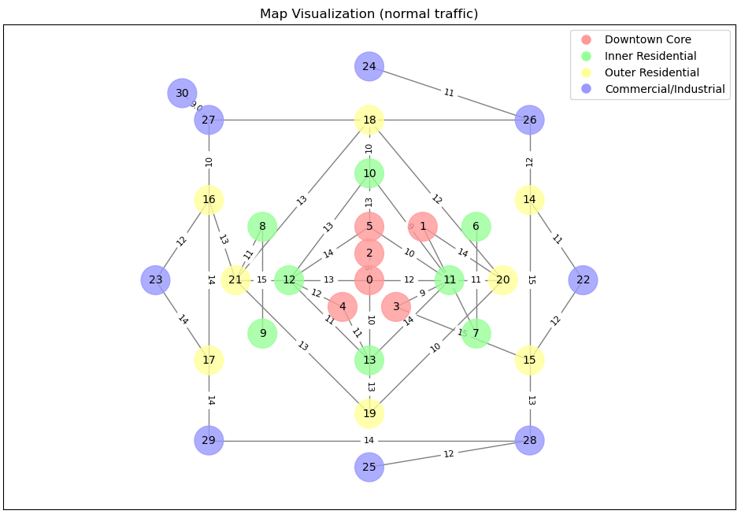

# Police Route Finder: Project Report

## Presentation Video:
https://psu.mediaspace.kaltura.com/media/1_8axvi7qa

## Goal of the Project
The goal of the project is to create a comprehensive system for managing crime and law enforcement operations using graph-based modeling and algorithms. The system features dual graphs: one representing crime locations and another representing police units and their paths. By integrating Dijkstra's algorithm, the project aims to calculate the shortest and most efficient routes for police response. This system is designed to enhance decision-making in law enforcement, minimize response times, and optimize resource allocation in real-time or planned scenarios.

The project also focuses on providing a scalable and flexible solution that can accommodate additional data inputs, such as real-time traffic updates or resource availability, making it a foundational tool for modern policing strategies.

## Significance of the Project
Efficient crime response is crucial for community safety and trust in law enforcement. The Police Route Finder is significant for several reasons:

### 1. Practical Application
- The graph system allows for modeling law enforcement dynamics independently
- The integration of Dijkstra's algorithm ensures optimal route planning for police units, which is vital during emergencies

### 2. Scalability
- The system can be expanded to include real-time data, such as traffic or road closures, enhancing its practical usability
- New nodes and edges can be added to the graphs dynamically, making it suitable for various geographical regions

### 3. Novelty
- Unlike existing systems that often focus on singular aspects (e.g., crime mapping or resource tracking), this project combines both crime detection and resource optimization in one framework
- It provides a visual and interactive interface for analysis and decision-making

### 4. Impact on Community Safety
- Reduces response time by optimizing police routes
- Provides insights into crime hotspots for proactive resource allocation and crime prevention strategies

### 5. Educational Value
- The project demonstrates the application of graph theory, algorithm design, and data visualization to solve real-world problems

## Installation and Instructions to Use

### Installation
1. Ensure Python 3.8 or higher is installed on your system
2. Install the required libraries by executing the following command:
   pip install matplotlib networkx jupyter
3. Clone the repository:
   git clone https://github.com/eah5837/CMPSC_463_proj2
4. Change drive using cd CMPSC_463_Proj2
5. Convert the Jupyter notebook to a Python script:
   jupyter nbconvert --to script Police_Route_Finder.ipynb
   - This will create a `Police_Route_Finder.py` file
6. Run the script:
   python Police_Route_Finder.py

### Alternative Usage (via Jupyter Notebook)
If you prefer using the notebook interface:
1. Open the notebook file (Police Route Finder.ipynb) using Jupyter Notebook
2. Load and execute all cells sequentially in the notebook
3. Explore the pre-defined crime and cops graphs by visualizing them
4. Use the `create_graph` function to add custom graphs with nodes, edges, and weights
5. Execute the `find_shortest_path` function to compute the optimal route between two points in the cops graph
6. View the shortest path and its associated cost, and analyze the visualization of the graph for detailed insights

## Structure of the Code

### 1. Core Classes

#### A. Graph Components
- **Vertex Class**

  class Vertex:
    - id: Unique identifier
    - x, y: Coordinate positions for graph
    - edges: Dictionary of connected vertices

- **Edge Class**

  class Edge:
    - vertex1, vertex2: Connected vertices
    - weights: Dictionary for different traffic conditions
      - light traffic
      - normal traffic
      - rush hour

- **Graph Class**

  class Graph:
    - vertices: Dictionary of all vertices
    Functions:
    - add_vertex(): Add new location point
    - add_edge(): Connect two locations
    - dijkstra(): Find shortest path
    - get_path_description(): Generate route details

#### B. Police Management
- **PoliceDispatchSystem Class**

  class PoliceDispatchSystem:
    - graph: Reference to city graph
    - cops: Dictionary of cop locations
    Functions:
    - add_cop(): Assign cop to location
    - remove_cop(): Remove cop from duty
    - find_nearest_cop(): Locate closest officer

### 2. Main Functions

#### A. Graph Creation and Setup
- **create_map()**: Initializes the complete city graph with:
  - Various vertices color-coded to represent parts of the city:
       - Downtown Core (vertices 0-5)
       - Inner Residential (vertices 6-13)
       - Outer Residential (vertices 14-21)
       - Commercial/Industrial Areas (vertices 22-29)
  - Several edges to connect vertices together

#### B. Visualization Functions
- **visualize_graph()**: Displays graph with:
  - Color-coded regions
  - Edge weights
  - Traffic conditions
  - Optional path highlighting

#### C. User Interface Functions
- **main_menu()**: Interactive system with options to:
  1. Display Current Map
  2. Assign Cop to Location
  3. Remove Cop from Duty
  4. Report Crime
  5. Add New Location
  6. List All Cops and Locations
  7. Exit Program

### 3. Algorithm Implementation

#### A. Path Finding
- Dijkstra's Algorithm Implementation:
  - Handles different traffic conditions
  - Calculates shortest paths
  - Returns total time and path

#### B. Direction Calculation
- Cardinal direction determination based on coordinates
- Natural language route descriptions
- Support for 8 directional points

### 4. Data Organization

#### A. Traffic Conditions
Three levels of traffic weight:
- Light traffic: 5-8 minutes
- Normal traffic: 9-15 minutes
- Rush hour: 16-30 minutes

#### B. Area Classification
Four distinct zones:
- Downtown Core: Vertices 0-5
- Inner Residential: Vertices 6-13
- Outer Residential: Vertices 14-21
- Commercial/Industrial: Vertices 22-29

## Functionalities and Test Results

### Functionalities
1. Multi Weight Edges:
   - Paths between vertices change depending on time
   - Algorithm has to rethink paths depending on how much traffic there is

2. Dynamic Input:
   - Nodes and edges can be added dynamically to customize scenarios
   - Support for different traffic conditions

3. Shortest Path Calculation:
   - Utilizes Dijkstra's algorithm for optimal routing
   - Accounts for traffic conditions in path selection

4. Graph Visualization:
   - Color-coded region display
   - Interactive map interface
   - Path highlighting

### Test Results
- Successfully created and visualized multi-region city graph
  
- Verified police dispatch functionality
  
  
  - Demonstrated accurate path finding with different traffic conditions
  
- Confirmed dynamic vertex and edge addition capabilities
  

## Showcasing the Achievement of Project Goals

### 1. Visualization
- Implemented color-coded region display
- Created clear visual distinction between different city areas
- Successfully integrated path highlighting for route demonstration

### 2. Routing Capability
- Successfully implemented Dijkstra's algorithm with traffic considerations
- Demonstrated efficient police unit routing
- Verified accurate travel time calculations

### 3. System Flexibility
- Implemented dynamic graph modification
- Supported multiple traffic conditions
- Demonstrated adaptability to different city layouts

### 4. Police Management
- Successfully implemented officer assignment system
- Demonstrated efficient nearest unit location
- Verified accurate response time calculation

## Discussion and Conclusions

### Discussion

The Police Route Finder demonstrates practical applications of computer science fundamentals through graph theory and Dijkstra's algorithm implementation for emergency response optimization. While successfully utilizing Dijkstra, limitations in static traffic conditions highlight the balance between theoretical models and real-world complexity. Despite these constraints, the project effectively achieves route optimization and providing valuable experience in algorithm implementation while illustrating how core computer science concepts can solve complex logistical challenges.

### Conclusions
This project successfully demonstrates the practical application of graph theory and algorithms in law enforcement logistics. The implementation shows how computer science concepts can be applied to real-world problems, particularly in emergency response optimization. While the current system has limitations, its modular design provides a solid foundation for future enhancements such as real-time data integration and more sophisticated traffic modeling.
